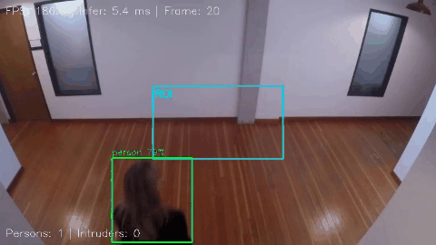

# Intrusion Detector — YOLOv8 + TensorRT

基于 YOLOv8 的人员闯入检测系统，纯 C++ TensorRT 高性能推理，**零 Python 运行时依赖**。



> 🟢 绿色框 = 人员  ·  🔴 红色框 = 闯入者  ·  🟡 青色矩形 = ROI 禁区  ·  左上角 = 实时 FPS

## 性能

| 指标 | 数值 |
|------|------|
| 推理速度 | **104 FPS**（RTX 5060 Laptop） |
| 单帧延迟 | **~6 ms** |
| 模型体积 | 14 MB（TensorRT Engine） |
| 缓存加载 | **< 0.1 秒** |
| 显存占用 | ~500 MB |

## 架构

```
视频/摄像头 → 预处理 → TensorRT YOLOv8 → NMS → ROI 闯入判定 → 可视化 + 告警
```

## 环境要求

| 组件 | 版本 |
|------|------|
| Ubuntu | 24.04 |
| CUDA | ≥12.x |
| TensorRT | ≥11.x |
| OpenCV | ≥4.6 |
| CMake | ≥3.18 |
| Python（仅导出模型用） | 3.10 + ultralytics |

## 快速开始

### 1. 导出 ONNX 模型

```bash
conda create -n trt-export python=3.10 -y
conda activate trt-export
pip install ultralytics onnx onnxruntime
python scripts/export_onnx.py --model yolov8n
# → model/yolov8n.onnx
```

### 2. 编译

```bash
mkdir build && cd build
cmake .. -DCMAKE_BUILD_TYPE=Release
make -j$(nproc)
```

### 3. 运行

```bash
# 弹窗交互模式
./IntrusionDetector --model ../model/yolov8n.onnx --video /path/to/video.mp4

# 保存结果视频（headless，无弹窗）
./IntrusionDetector --model ../model/yolov8n.onnx --video input.mp4 --output result.mp4 --no-display

# 自定义 ROI + 阈值
./IntrusionDetector --model ../model/yolov8n.onnx --video input.mp4 --roi 200,150,500,400 --conf 0.4
```

## 命令行参数

| 参数 | 默认值 | 说明 |
|------|--------|------|
| `--model` | `../model/yolov8n.onnx` | ONNX 模型路径 |
| `--engine` | 自动生成 | TensorRT engine 缓存路径 |
| `--video` | 摄像头 0 | 视频文件路径 |
| `--output` | 无 | 保存结果视频（.mp4） |
| `--no-display` | `false` | Headless 模式，不弹窗 |
| `--conf` | `0.45` | 置信度阈值 |
| `--nms` | `0.45` | NMS IoU 阈值 |
| `--roi` | 画面中央 30% | 闯入区域 `x1,y1,x2,y2` |

## 操作按键

| 按键 | 功能 |
|------|------|
| `q` / `ESC` | 退出 |
| `Space` | 暂停/恢复 |

## 工作原理

1. **首次运行**：从 ONNX 构建 TensorRT engine 并序列化到 `.engine` 文件（约 5 秒）
2. **后续运行**：直接加载 `.engine` 缓存，启动 < 0.1 秒
3. **推理**：640×640 输入，TensorRT 自动 FP16 推理，类内 NMS
4. **闯入判定**：所有 person 类的 bbox 中心点 vs ROI 矩形
5. **输出**：窗口实时显示 / 写入 MP4 视频 / Headless 批处理

## 项目结构

```
Tensor/
├── model/               # ONNX 模型（TRT Engine 自动缓存）
├── scripts/
│   └── export_onnx.py   # PyTorch → ONNX 导出
├── include/             # 头文件
│   ├── engine.h         # TensorRT RAII 封装
│   ├── detector.h       # YOLO 检测器
│   ├── intrusion.h      # 闯入判定
│   └── visualizer.h     # 可视化
├── src/                 # 实现
│   ├── main.cpp
│   ├── engine.cpp
│   ├── detector.cpp
│   ├── intrusion.cpp
│   └── visualizer.cpp
└── CMakeLists.txt
```

## License

MIT
